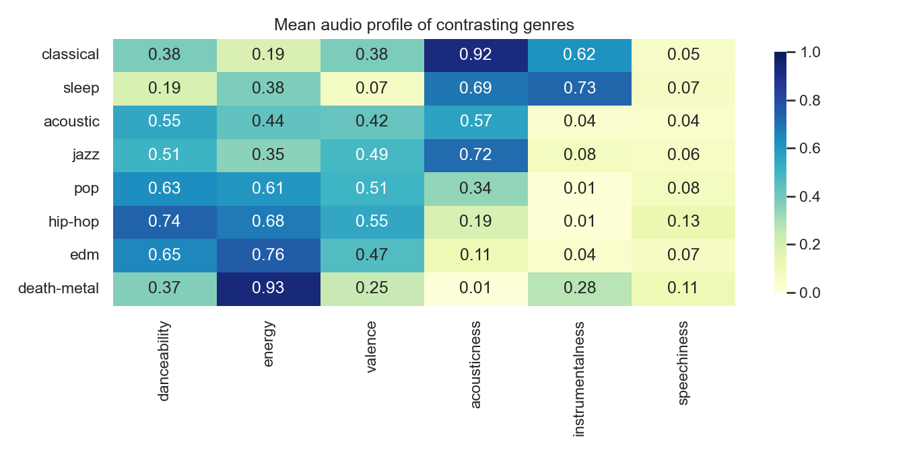

# Spotify Track Recommender

A content-based music recommendation system built on the
[Spotify Tracks Dataset](https://www.kaggle.com/datasets/maharshipandya/-spotify-tracks-dataset)
(114,000 rows, 114 genres). Given a track, or a genre and preference
profile, the system recommends the most *similar-sounding* tracks in the
catalogue and explains, in plain language, why each one was recommended.

The dataset contains no user listening histories, so this is a
**content-based** recommender (tracks are matched on their audio features and
genre labels), not collaborative filtering. A popularity baseline is included
for comparison, together with a proxy evaluation that quantifies how much the
content-based model improves over it.

```text
Query: Master of Puppets - Metallica  [hard-rock; metal]

 1. Sweet Child O' Mine - Guns N' Roses     (sim 0.853)
    ↳ Similar speechiness (0.04 vs 0.04), acousticness (0.00 vs 0.09),
      energy (0.84 vs 0.91); shares the 'hard-rock' genre
 2. Welcome To The Jungle - Guns N' Roses   (sim 0.834)
    ↳ Similar acousticness (0.00 vs 0.02), instrumentalness (0.43 vs 0.40),
      loudness (-9.1 dB vs -8.1 dB); shares the 'hard-rock' genre
 ...
```

## Dataset

| | |
|---|---|
| **Name** | 🎹 Spotify Tracks Dataset |
| **Author** | Maharshi Pandya |
| **Source** | Collected via the Spotify Web API |
| **Link** | <https://www.kaggle.com/datasets/maharshipandya/-spotify-tracks-dataset> |
| **DOI** | <https://doi.org/10.34740/kaggle/dsv/4372070> |
| **License** | Database: Open Database; Contents: © Original Authors |

Each of the 114,000 rows is a *(track, genre)* pair with Spotify audio
features (danceability, energy, valence, tempo, ...), basic metadata, and a
popularity score. The CSV is included in this repository at
`data/dataset.csv` under its original license; it can also be re-downloaded
from the Kaggle link above. Note that the file contains **114** genres (the
Kaggle card mentions 125) and a handful of rows with physically impossible
values (`tempo = 0`, `duration_ms = 0`); see `report_summary.md` for the
full data audit.

## Project structure

```text
.
├── data/
│   └── dataset.csv               # the Kaggle CSV (included)
│
├── outputs/                      # created/refreshed by main.py
│   ├── figures/                  # 4 EDA figures (PNG)
│   ├── sample_recommendations.csv
│   └── evaluation_results.csv
│
├── src/
│   ├── __init__.py
│   ├── config.py                 # all paths, feature weights, parameters
│   ├── data_loading.py           # load + validate + dataset overview
│   ├── preprocessing.py          # cleaning + de-duplicated track catalogue
│   ├── eda.py                    # the 4 figures
│   ├── recommender.py            # popularity baseline + content-based model
│   ├── evaluation.py             # proxy evaluation (3 systems compared)
│   └── utils.py                  # formatting / printing helpers
│
├── main.py                       # pipeline entry point + CLI
├── requirements.txt
├── README.md
├── report_summary.md             # written report (methodology + findings)
├── LICENSE
└── .gitignore
```

## Setup

Requires **Python 3.10+**.

```bash
# from the project root:

# (recommended) create a virtual environment
python3 -m venv .venv
source .venv/bin/activate          # Windows: .venv\Scripts\activate

pip install -r requirements.txt
```

## How to run

### Full pipeline

```bash
python main.py
```

This loads and validates the data, cleans it, builds the de-duplicated track
catalogue, saves 4 EDA figures, builds both recommenders, prints sample
recommendations (saved to `outputs/sample_recommendations.csv`), and runs the
proxy evaluation (saved to `outputs/evaluation_results.csv`). The whole run
takes well under a minute on a normal laptop.

Flags: `--skip-eda` and `--skip-eval` skip the figures / evaluation steps.

### Ad-hoc queries from the command line

```bash
# 1) by track name
python main.py --recommend "Blinding Lights"

# 2) by track name + artist (disambiguates covers / common titles)
python main.py --recommend "Hotel California" --artist "Eagles" -n 5

# 3) by genre/preference profile (when you have no seed track)
python main.py --genres "jazz" --prefs "acousticness=0.85,energy=0.25"
```

Track search is case-insensitive, falls back to substring matching, and picks
the most popular match when several catalogue entries fit. Misspelled genres
get "did you mean ..." suggestions (e.g. `--genres "jaz"` becomes `jazz`).

## How it works

**1. Cleaning.** The `Unnamed: 0` index column is dropped, along with 1 row
missing all metadata and 157 rows with `tempo <= 0` or `duration_ms <= 0`
(~0.14% of the data).

**2. De-duplication into a track catalogue.** 24,259 of the 114,000 rows are
repeats of a `track_id`. An audit shows that within a repeated id only the
genre label and popularity ever differ (the audio features are identical),
so rows are collapsed to one entry per `track_id`, keeping the *set* of
genre labels and the maximum popularity. Result: a catalogue of **89,583
unique tracks**, 16,299 of which carry more than one genre.

**3. Feature space.** Ten audio features are standardised (z-scored) and
weighted; for example `liveness` gets 0.5 and `duration_ms` 0.4 (see
`src/config.py` for each weight and its rationale). Genre is added as a
row-normalised multi-hot block with weight 2.0: a strong *secondary* signal
that cannot dominate the audio similarity. **Popularity is deliberately
excluded** from the similarity space: it measures fame, not sound.

The genre profiles below show why this feature space works: the audio
features genuinely separate musical styles.



**4. Similarity search.** Cosine nearest-neighbours (scikit-learn, brute
force: exact, and fast enough at this scale, since the 89,583 × 124 index
builds in about 0.2 s). For each query the system fetches a 300-candidate
pool, removes the query track itself and same-name/same-artist duplicates,
and applies a diversity cap of **max 2 tracks per artist**.

**5. Explanations.** Each recommendation cites the three audio features on
which the two tracks agree most (smallest standardised gap, favouring the
query's distinctive traits), with raw values formatted in natural units
(BPM, dB, m:ss), plus a genre-overlap note.

**6. Baseline + evaluation.** A popularity baseline (global or per-genre
top-N) is compared against the content-based model over 200 random query
tracks (top-10, fixed seed):

| system | genre_overlap@10 ↑ | audio_distance@10 ↓ | artist_diversity@10 ↑ | mean_popularity@10 |
|---|---|---|---|---|
| random | 0.014 | 4.114 | 0.999 | 32.8 |
| popularity (global) | 0.016 | 3.556 | 0.800 | 97.2 |
| **content-based** | **0.993** | **1.365** | 0.856 | 33.8 |

The content-based model shares a genre with the query in over 99% of cases,
cuts the audio-feature distance to roughly a third of random, and keeps high
artist diversity, while the popularity baseline just returns the same famous
tracks regardless of the query (mean popularity 97/100).

## Outputs

| File | Contents |
|---|---|
| `outputs/sample_recommendations.csv` | Baseline top-5 for *rock*, content-based top-10 for three seed tracks and one jazz preference profile, each row with similarity score and explanation |
| `outputs/evaluation_results.csv` | The evaluation table above |
| `outputs/figures/popularity_distribution.png` | Popularity histogram (10.4% of tracks have popularity 0) |
| `outputs/figures/tracks_per_genre.png` | Genre balance check, raw vs de-duplicated |
| `outputs/figures/feature_correlation_heatmap.png` | Audio-feature correlations (motivates the loudness down-weight) |
| `outputs/figures/genre_audio_profiles.png` | Mean audio profile of 8 contrasting genres |

## Limitations

- **No user interaction data**, so this is content-based filtering only.
  True accuracy metrics (precision@k against held-out listening data) are
  impossible here; the evaluation uses *proxy* metrics instead.
- The catalogue is a **2022 snapshot**; newer tracks cannot be recommended,
  and any query track must already exist in the catalogue (cold-start).
- **Genre labels are noisy**: each row carries a single label from one
  source, so the multi-genre sets are incomplete rather than authoritative.
- The audio features are **Spotify's model estimates**, not ground truth.
- Explanations are heuristic summaries of feature proximity, not causal
  statements about *why* the model ranked a track highly.

See `report_summary.md` for the full write-up.

## Citation

If you use the dataset, please cite the original author:

```bibtex
@misc{maharshi_pandya_2022,
  title     = {🎹 Spotify Tracks Dataset},
  url       = {https://www.kaggle.com/dsv/4372070},
  DOI       = {10.34740/KAGGLE/DSV/4372070},
  publisher = {Kaggle},
  author    = {Maharshi Pandya},
  year      = {2022}
}
```

## License

The code is free to use and modify; see the [LICENSE](LICENSE) file. The
dataset is redistributed under its original terms (Database: Open Database;
Contents: copyright of the original authors) and is credited above.

## Author

Rizky Fildza

Built with the help of Claude Fable 5 (Anthropic) for pair programming and
drafting the documentation. All design decisions, code review, and the
final write-up were checked and owned by me.